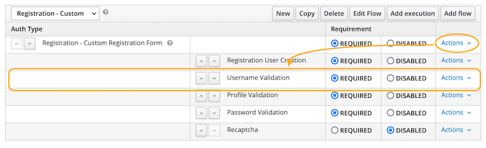

# Keycloak Username validator

This is a keycloak Form Action SPI which allows usernames to be validated against
a regular expression.
A use case for this is when the username is common across a platform, some components
of which rely on a more restricted character set (e.g. no whitespace or special
characters). This SPI will ensure that any such criteria are applied when users
select a username.

## Registering and configuraing the Username Validator

### Registering

**TL;DR** Copy the jar file into `/opt/jboss/keycloak/standalone/deployments` on the
Keycloak server.

Alternatively, follow the instructions for [Registering provider implementations](https://www.keycloak.org/docs/latest/server_development/index.html#registering-provider-implementations) on the Keycloak documentation.

### Verification

Check that the SPI has been properly registered by logging in to the Keycloak admin
console, selecting _Server Info_ from the user profile drop down in the top-right,
then selecting the _Providers_ tab.

The `username-validation` provider should be listed under the `form-actions` SPI.

### Configuration

To configure:

1. Login to keycloak admin and navigate to the realm you want to add validation
2. Select _Configure &rarr; Authentication_ from the left-hand side menu
3. Select the _Flows_ tab
4. Select the **Registration** flow in the drop-down list
5. Click the **Copy** button on the right-hand side and give the new flow a meaningful name.
6. Open your new flow and select _Actions &rarr; Add execution_ from the **Registration form** flow.

You can move the action to the required level of priority using the arrows to the left of the entry.

